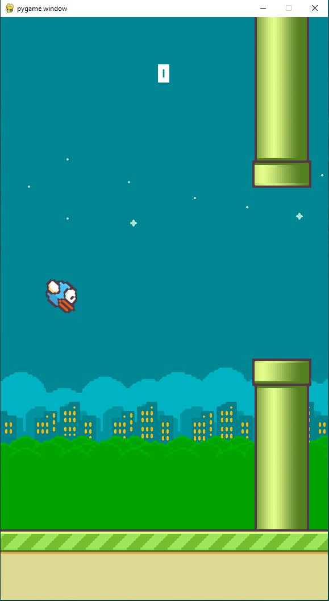
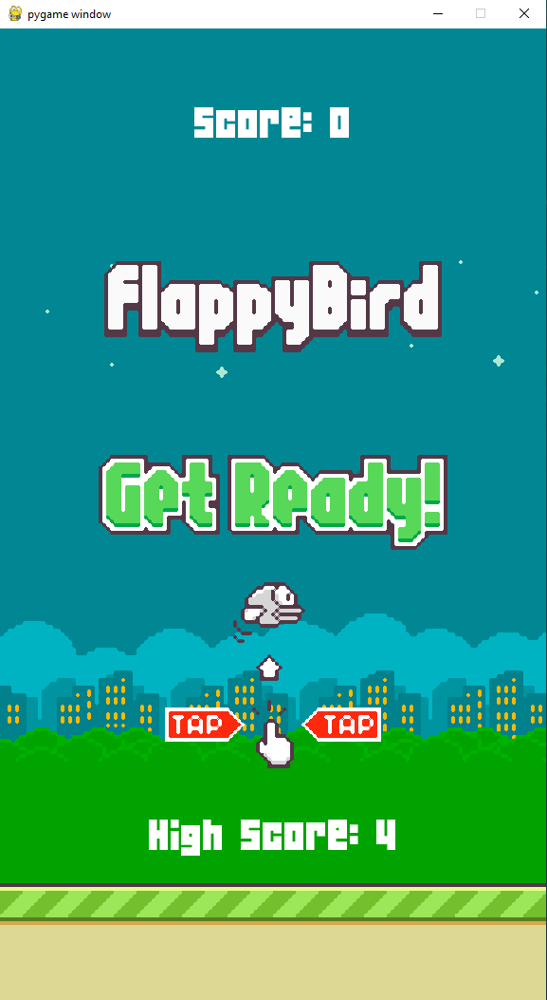

# OSP-Project

Flappy Bird
=============

A Flappy Bird Clone with new Additions!

**Features**

* New Level Designs
* Practice Mode
* Random Level Generator
* Multiplayer Mode
* Lives System
* New Characters

Enjoy.

How to Install
---------------

1. Install Python 2.7 or greater
2. Install Pygame from IDE terminal
3. Clone this repository or Download Zip & Extract it
4. Open & Run flappy-bird-master folder from IDE
5. Use "SpaceBar" to control your character.

ScreenShot
-----------

